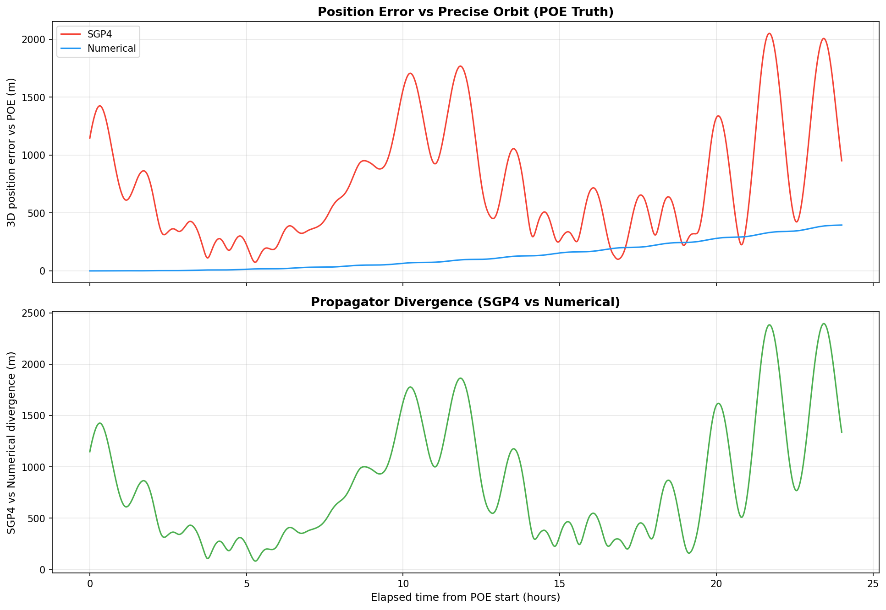
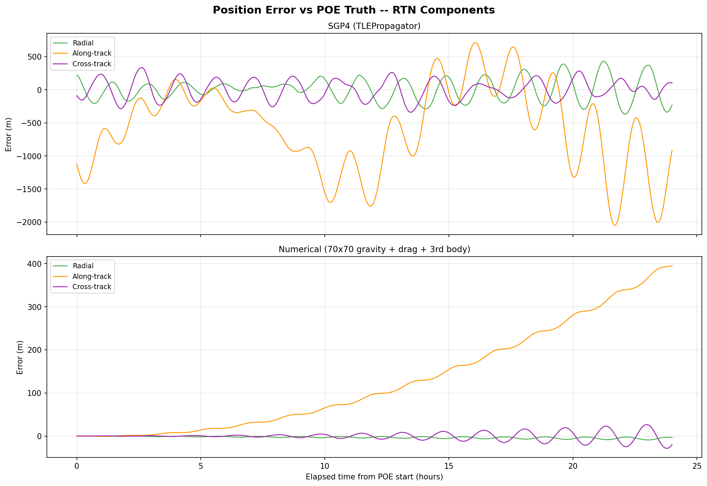
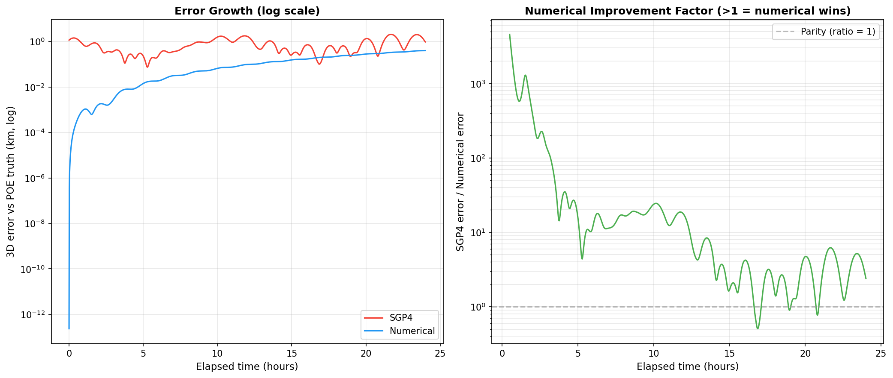

# SGP4 vs Numerical Propagation: Accuracy Comparison Against Precise Orbit Ephemerides

**Date:** 2026-03-04
**Object:** Sentinel-1A (NORAD 39634)
**Ground Truth:** ESA Copernicus POEORB (Precise Orbit Determination)
**Script:** `analysis/sgp4_vs_numerical.py`

---

## 1. Motivation

Conjunction screening for Space Situational Awareness (SSA) relies on propagating orbital states forward in time to predict close approaches. The accuracy of these predictions is bounded by the propagation model used. Two classes of propagator are common:

- **SGP4 (Simplified General Perturbations 4):** An analytical model that applies closed-form corrections for major perturbations (J2, J3, J4 zonal harmonics, atmospheric drag, lunar/solar gravity). It is the standard propagator for NORAD Two-Line Element sets (TLEs).
- **Numerical propagation:** Directly integrates the equations of motion under a configurable set of force models (high-degree gravity, atmospheric drag, third-body attraction, relativity). More computationally expensive but physically rigorous.

Understanding the accuracy gap between these two approaches -- and under what conditions numerical propagation provides a meaningful improvement -- is critical for sizing conjunction screening thresholds and deciding when to escalate from catalogue-level screening to high-fidelity analysis.

## 2. Theory: Why SGP4 Has Inherent Accuracy Limitations

### 2.1 Mean Elements vs Osculating Elements

The fundamental limitation of SGP4 lies in its use of **mean elements**. A TLE does not encode the satellite's true instantaneous (osculating) position and velocity. Instead, TLE elements are *mean values* that have been fitted within SGP4's own analytical perturbation theory. These mean elements include artificial offsets designed to cancel out when propagated through SGP4's internal corrections.

This creates a self-consistent but approximate system:

```
TLE (mean elements)  -->  SGP4 theory  -->  approximate osculating state
```

The mean-to-osculating conversion introduces periodic errors at the orbital period. When SGP4 propagates from a TLE, the output position oscillates around the true trajectory with an amplitude determined by the unmodeled short-period perturbation terms -- typically hundreds of metres to several kilometres for LEO objects.

### 2.2 Simplified Force Models

SGP4 models only a subset of the perturbations acting on a satellite:

| Perturbation | SGP4 | Numerical (this study) |
|---|---|---|
| Earth gravity (zonal) | J2, J3, J4 only | 70x70 spherical harmonics |
| Earth gravity (tesseral) | Not modelled | 70x70 (included) |
| Atmospheric drag | Simplified power-law density | Harris-Priester model |
| Solar gravity | Included (simplified) | Full third-body attraction |
| Lunar gravity | Included (simplified) | Full third-body attraction |
| General relativity | Not modelled | Schwarzschild correction |
| Solar radiation pressure | Not modelled | Not modelled* |

*SRP was excluded from this study for parity; it would further improve the numerical propagator.

The omission of tesseral harmonics (non-axially-symmetric gravity terms) means SGP4 cannot model longitude-dependent gravitational variations. For LEO, the dominant unmodeled terms produce along-track timing errors that grow approximately linearly with time.

### 2.3 TLE Fitting Noise

TLEs are generated by fitting mean elements to a set of radar/optical observations over a short arc. The fitting process introduces noise that depends on:

- Number and geometry of tracking observations
- Time span of the fitting arc
- Sensor measurement accuracy
- Atmospheric density model errors during the fit

This means consecutive TLEs for the same object can differ by hundreds of metres to several kilometres in the position they imply, even at overlapping epochs. This TLE-to-TLE inconsistency sets a floor on the accuracy achievable by any TLE-based propagator.

## 3. Simulation Setup

### 3.1 Ground Truth: ESA Precise Orbit Ephemerides

The comparison uses **Sentinel-1A POEORB** files from ESA's Copernicus Precise Orbit Determination service. These provide:

- **Osculating state vectors** (position + velocity) in the ITRF (Earth-fixed) frame
- **10-second intervals** over a ~26-hour validity window
- **Centimetre-level accuracy** (post-processed using GPS, DORIS, and laser ranging)

The specific file used covers:

```
Validity: 2026-02-10 22:59:42 UTC  -->  2026-02-12 00:59:42 UTC
States:   9,361 osculating state vectors
Source:   S1A_OPER_AUX_POEORB_OPOD_20260303T070419_V20260210T225942_20260212T005942.EOF
```

### 3.2 Numerical Propagator Configuration

The numerical propagator is initialised from the **first POE state vector**, converted from ITRF to EME2000 (J2000 inertial frame) using Orekit's high-fidelity frame transformations (including Earth orientation parameters, precession, nutation, and polar motion).

| Parameter | Value |
|---|---|
| Integrator | Dormand-Prince 8(5,3) |
| Min/Max step | 0.001 s / 60 s |
| Position tolerance | 1.0 m |
| Gravity field | Holmes-Featherstone 70x70 |
| Atmosphere | Harris-Priester (mean solar activity) |
| Third-body | Sun + Moon (full ephemeris) |
| Relativity | Schwarzschild correction |
| Satellite mass | 2,300 kg |
| Cross-section | 25 m^2 |
| Drag coefficient | 2.2 |

### 3.3 SGP4 Propagator

SGP4 is initialised from the **closest available TLE** to the POE start epoch. This TLE was selected from Space-Track's `gp_history` archive:

```
TLE epoch:  2026-02-10 13:53:41 UTC
TLE age:    9.1 hours before POE start
```

The TLE age of 9.1 hours is representative of operational conditions -- TLEs are typically updated every 6-12 hours for well-tracked objects like Sentinel-1A.

### 3.4 Comparison Methodology

Both propagators are evaluated at 60-second intervals over the 24-hour POE window. At each timestep:

1. The POE truth state is obtained by linear interpolation of the 10-second ephemeris
2. Both propagator states are transformed to ITRF for direct comparison against the POE
3. Position errors are decomposed into RTN (Radial, Along-track, Cross-track) components
4. 3D RSS position error is computed

This approach gives each propagator its **natural best-case initial condition**: the numerical propagator receives a true osculating state from the POE, while SGP4 uses its native mean-element TLE. This is the fairest comparison -- it measures each method's inherent modelling accuracy rather than penalising either for an incompatible initial state.

## 4. Results

### 4.1 Position Error vs POE Truth



The top panel shows the 3D position error for both propagators against the POE ground truth. Key observations:

- **SGP4** oscillates between 200-2,000 m with a period matching the orbital period (~99 min). This oscillation is the signature of mean-to-osculating element conversion errors -- the TLE's mean elements periodically align with and diverge from the true osculating state.
- **Numerical propagation** starts near zero (initialised from the POE itself) and grows smoothly to ~396 m at 24 hours. The growth is monotonic and dominated by along-track drift.

The bottom panel shows the divergence between the two propagators themselves, which oscillates between 200-1,800 m.

### 4.2 RTN Error Decomposition



The RTN decomposition reveals the physical mechanisms behind each propagator's errors:

**SGP4 (top panel):**
- **Along-track** (orange) dominates, oscillating +/-1,500 m at orbital period. This is the mean-to-osculating timing offset -- SGP4's mean elements predict the satellite slightly ahead or behind its true along-track position, swapping sign each half-orbit.
- **Radial** (green) and **cross-track** (purple) oscillate at smaller amplitudes (~500 m), consistent with the radial and out-of-plane components of the J2 short-period terms that SGP4 handles analytically but imperfectly.

**Numerical (bottom panel):**
- Error grows **smoothly from zero** in all components
- **Along-track** dominates, reaching ~350 m at 24 hours -- this is primarily atmospheric drag modelling error. The Harris-Priester model uses a static mean-solar-activity density profile, which differs from the true thermospheric density that Sentinel-1A experienced.
- Radial and cross-track errors remain below 100 m throughout, indicating the gravity field and third-body models are well-calibrated.

### 4.3 Error Growth and Improvement Factor



The left panel (log scale) shows error growth over 24 hours:

- Numerical error grows from ~10^-13 km (floating-point zero at the initial epoch) through ~10^-2 km at 12h to ~0.4 km at 24h
- SGP4 error remains between 0.2-2 km throughout, with no clear growth trend (it is dominated by the periodic mean-to-osculating oscillation rather than secular drift)

The right panel shows the improvement ratio (SGP4 error / Numerical error) on a log scale:

| Time | SGP4 Error | Numerical Error | Improvement |
|------|-----------|----------------|-------------|
| 0.5 h | 1,326 m | 0.3 m | 4,569x |
| 1 h | 681 m | 1.0 m | 669x |
| 4 h | 245 m | 8.0 m | 31x |
| 8 h | 632 m | 37 m | 17x |
| 12 h | 1,680 m | 98 m | 17x |
| 18 h | 325 m | 220 m | 1.5x |
| 24 h | 952 m | 396 m | 2.4x |

The numerical propagator is **orders of magnitude** more accurate at short prediction horizons (< 4 hours) and maintains a 2-17x advantage throughout the 24-hour window. The ratio oscillates because SGP4's error is periodic while numerical error grows monotonically -- when SGP4 happens to pass through a low-error node, the ratio dips.

## 5. Discussion

### 5.1 Implications for Conjunction Screening

For conjunction screening at the **catalogue level** (thousands of objects, multi-day prediction windows), SGP4 with TLEs remains the practical choice. Its ~1 km accuracy over 24 hours, while coarse, is adequate for initial screening with conservative miss-distance thresholds (typically 5-25 km).

However, for **high-fidelity conjunction assessment** of individual events -- where the screening has already identified a potential close approach and operators need to decide whether to manoeuvre -- the numerical propagator provides significantly better accuracy. The 2-17x improvement means that a conjunction predicted at 5 km by SGP4 could be refined to a much tighter (or wider) miss distance, directly informing the manoeuvre decision.

### 5.2 The Initial State Problem

This comparison gave the numerical propagator an ideal initial condition (cm-level POE truth). In operational practice, most objects do not have precise orbit ephemerides -- their states are known only through TLEs. Initialising a numerical propagator from a TLE-derived state (as we demonstrated in an earlier iteration of this study) produces **worse** results than SGP4, because the TLE mean elements contain artificial offsets that are inconsistent with physical force models.

This highlights a critical operational constraint: **numerical propagation is only as good as its initial state**. To realise the accuracy gains shown here, operators need:

- Precise orbit determination (POD) products (available for ~100 satellites with GPS/DORIS/SLR)
- Radar or optical observations processed through an orbit determination filter
- Or at minimum, a mean-to-osculating element conversion before initialising the numerical propagator

### 5.3 Dominant Error Sources

For the **numerical propagator**, the dominant error at 24 hours is along-track drift caused by atmospheric drag modelling uncertainty. The Harris-Priester model uses a static density profile; replacing it with a dynamic model (e.g., NRLMSISE-00 or JB2008) driven by actual space weather indices would likely reduce the 24-hour error below 100 m.

For **SGP4**, the dominant error is structural -- the mean-to-osculating oscillation of ~1-2 km is inherent to the two-line element / SGP4 framework and cannot be reduced without abandoning the TLE format entirely.

### 5.4 Achieving Better Initial States: The Case for Independent SSA Sensors

The results of this study demonstrate that orbit determination accuracy is the binding constraint on propagation quality. Space-Track, the primary public source of RSO tracking data, distributes only TLEs -- mean element sets fitted to SGP4 theory. This imposes a hard ceiling: regardless of how sophisticated a downstream propagator is, a TLE-derived initial state carries ~1 km of mean-to-osculating ambiguity that cannot be removed after the fact.

To unlock the accuracy demonstrated by the numerical propagator in this study, an SSA operator needs access to **osculating state vectors** (position, velocity) and ideally their associated **covariance matrices** -- the 6x6 state error covariance that quantifies uncertainty in each component of the orbital state. Space-Track does not provide covariance data for GP-derived products; it is only available in Conjunction Data Messages (CDMs) for specific screened events, and even then only for the two objects involved.

Operating **independent SSA sensors** -- ground-based radar, optical telescopes, or passive RF receivers -- enables an organisation to:

1. **Perform independent orbit determination (OD).** Raw sensor measurements (range, range-rate, azimuth, elevation, or angular positions) are processed through a batch least-squares or sequential filter (e.g., Extended Kalman Filter) to estimate the full osculating state vector and its covariance. This produces the kind of initial condition that our numerical propagator used -- a true physical state rather than SGP4 mean elements.

2. **Generate state covariance matrices for all tracked RSOs.** The covariance matrix is essential for conjunction assessment: it defines the uncertainty ellipsoid around each object's predicted position, which directly determines collision probability. Without covariance, miss distance alone is insufficient for risk quantification. TLEs provide no covariance information.

3. **Control observation cadence and timeliness.** Space-Track TLEs are typically updated every 6-12 hours for well-tracked objects, but can be days old for less-observed RSOs. An independent sensor network can prioritise observations of objects involved in upcoming conjunctions, reducing state age and improving prediction accuracy at the critical moment.

4. **Fuse multiple data sources.** Independent sensor data can be combined with TLEs, CDMs, owner/operator ephemerides, and other sources in a multi-sensor fusion architecture. This over-determined system produces more accurate and robust state estimates than any single source.

The accuracy hierarchy is roughly:

| Data Source | State Type | Typical Position Accuracy | Covariance Available |
|---|---|---|---|
| Space-Track TLE | Mean elements (SGP4) | ~1-2 km | No |
| Independent radar OD | Osculating state + covariance | ~10-100 m | Yes |
| Independent optical OD | Osculating state + covariance | ~50-500 m | Yes |
| GPS/DORIS POD (cooperative) | Osculating state + covariance | ~1-10 cm | Yes |

For an SSA organisation seeking to move beyond catalogue-level screening toward actionable conjunction assessment, investing in independent sensor capabilities is the single highest-leverage step -- it unlocks the full potential of numerical propagation methods like those demonstrated in this study.

### 5.5 Limitations of This Study

- **Single object:** Sentinel-1A is a well-tracked, non-manoeuvring satellite in a sun-synchronous orbit (~693 km). Results may differ for higher/lower altitudes, eccentric orbits, or objects with fewer tracking observations.
- **Single epoch:** One 24-hour window was analysed. Solar activity, geomagnetic storms, and atmospheric tides cause density variations that would change the numerical propagator's drag error.
- **No SRP:** Solar radiation pressure was not modelled. For objects with high area-to-mass ratios (e.g., rocket bodies, debris), SRP becomes significant and would affect both propagators differently.
- **Harris-Priester atmosphere:** A more sophisticated density model would improve numerical accuracy. The 396 m error at 24 hours is partly an artefact of this simplified model.

## 6. Conclusions

1. **Numerical propagation is 2-17x more accurate than SGP4** over a 24-hour window when initialised from a precise osculating state (POE), with the advantage being largest at short prediction horizons.

2. **SGP4's error is dominated by periodic mean-to-osculating oscillations** (~1-2 km amplitude at orbital period), which are inherent to the TLE/SGP4 framework and cannot be reduced by better TLE fitting.

3. **The numerical propagator's error grows monotonically** and is dominated by along-track drift from atmospheric drag uncertainty (~396 m at 24 hours with Harris-Priester).

4. **Initial state quality is the critical bottleneck.** Numerical propagation from TLE-derived states performs worse than SGP4 because TLE mean elements are inconsistent with physical force models. Precise orbit data is required to realise the accuracy gains of numerical methods.

5. For operational SSA conjunction screening, the recommended approach is a **two-tier architecture**: SGP4/TLE for broad catalogue screening, escalating to numerical propagation with the best available initial state for individual high-concern events.
